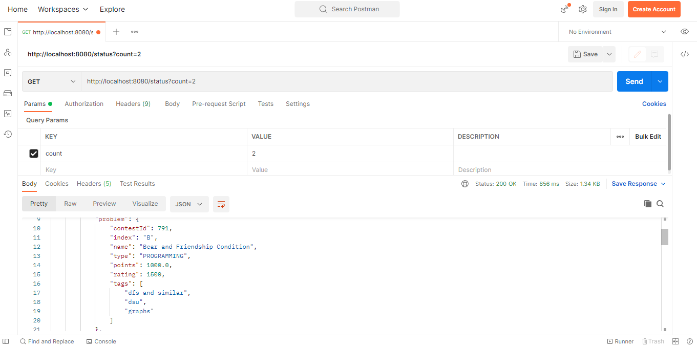
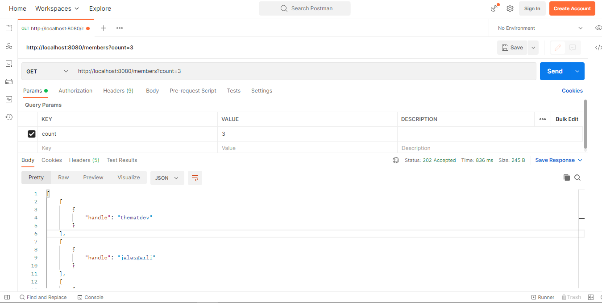

# consuming-rest-open-feign

This project uses the Codeforces API: https://codeforces.com/apiHelp/methods#problemset.recentStatus
Codeforces is a Competitive Programming Platform and by using the API provided, we can access some
data like Contests, Rating, Problem Set, Blog Entries, User Handles etc.

In this case I am using the #problemset.recentStatus endpoint to get the Recent submissions.
so according to the api we have to issue a GET request to the  https://codeforces.com/api/problemset.recentStatus
URI and there is a request-param to be added with name count, which has to be assigned value upto 1000, so it
will get us that many submissions entries.

To Consume the data I am using the **Spring Open-Feign**, which is great for consuming rest-data as you can see
that i have to model the data first that will be the POJO representation of JSON data,
which can be done via using Java Records.
Next I have a Rest-Controller which has a method action mapped with ("/status") path and then
its simple, In the proxy I have a contract in which i only have to specify the base-uri and unique name to the client.
Then as it is an interface, so only define the method and implementation will be provided by the Open-Feign. So in this 
case i only specify the resource path which using GetMapping and here just specify the Query-Param which is count and
then the return type is specified ProblemStatus which is our Model. So it will try to decode it into our POJO. 
_And remember that the fields should be same as that of the JSON response object, unless it will be assigned to null._ The
JSON response fields and Java object fields should match exactly.

To run the project, use command: **_mvn spring-boot:run_**
We can also use the mvn wraper (.mvnw.cmd) 

**There are two endpoints that we can query from the client:**

    1. http://localhost:8080/status?count=2 -> To get the Complete Status Object as an Array.
    2. http://localhost:8080/members?count=2 -> To get only the Members.

I have used **Postman** for querying the endpoints and verifying the response:

